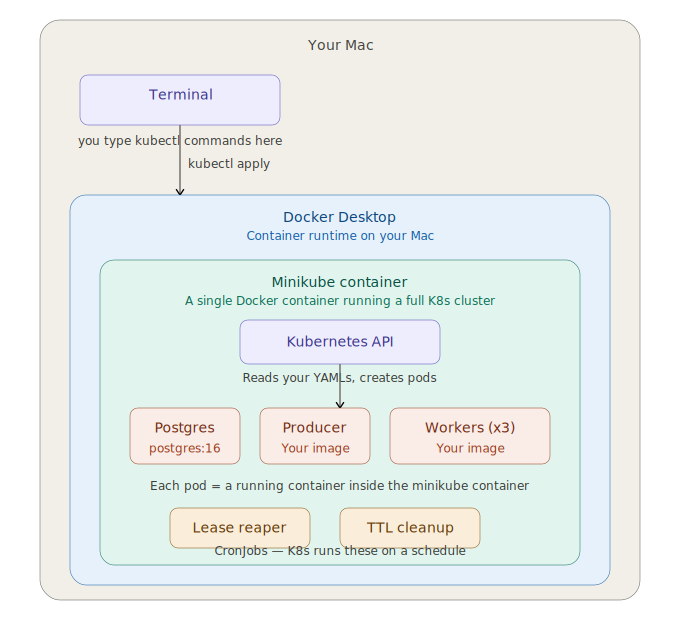

# taskqueue

Async task queue library backed by Postgres. Provides durable job queuing with at-least-once delivery, automatic retries with exponential backoff, dead-letter handling, and lease-based failure detection. Designed to run in Kubernetes with zero infrastructure beyond the database.

## Architecture

Everything runs locally inside a minikube cluster on Docker Desktop. You interact via `kubectl` from your terminal.



- **Postgres** — single pod, stores all job state
- **Producer** — enqueues fake jobs in a loop
- **Workers (x3)** — compete for jobs via `SELECT ... FOR UPDATE SKIP LOCKED`
- **Lease reaper** — CronJob that reclaims stuck jobs every 30s
- **TTL cleanup** — CronJob that deletes old completed/dead-lettered jobs daily

## Prerequisites

- Python 3.11+
- Postgres 16+

## Setup

```bash
# Clone and enter the project
git clone <repo-url>
cd task_queue

# Create and activate a virtual environment
python3 -m venv .venv
source .venv/bin/activate

# Install the package and dev dependencies
pip install -e ".[dev]"
```

## Run tests

```bash
pytest
```

## Project structure

```
src/taskqueue/       # Library source code
  __init__.py
  models.py          # Job dataclass
  db.py              # Database connection
tests/               # Test suite
Dockerfile           # Single image, multiple roles via ROLE env var
entrypoint.sh        # Dispatches to producer/worker/reaper/cleanup
pyproject.toml       # Package metadata and dependencies
```

## Docker

```bash
docker build -t taskqueue .

# Run as different roles
docker run -e ROLE=worker -e DATABASE_URL=postgres://... taskqueue
docker run -e ROLE=producer -e DATABASE_URL=postgres://... taskqueue
```
